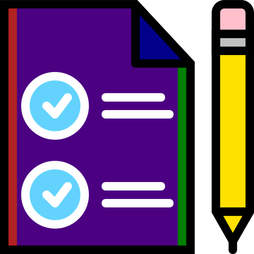
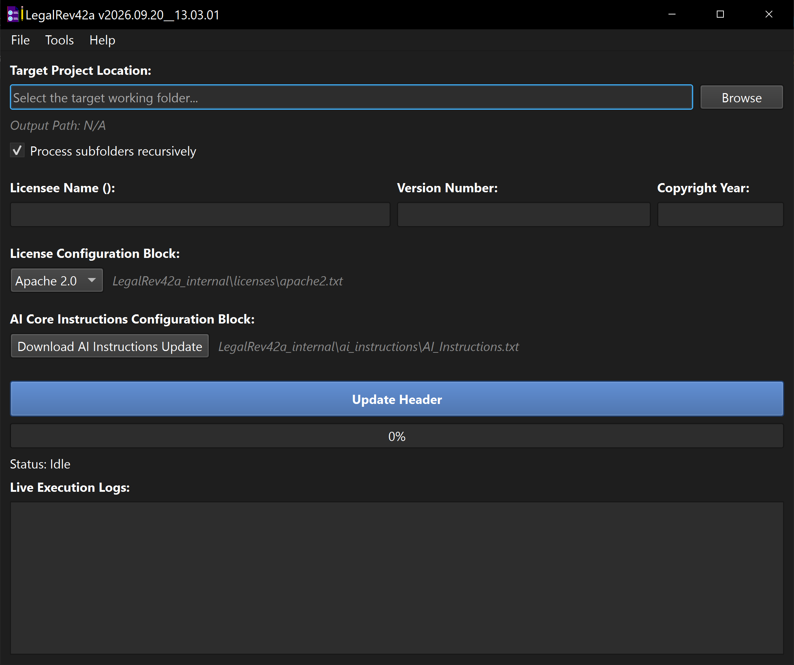

#  LegalRev42a™ 
**A workspace header standardization utility designed to securely parse, synchronize, and inject license frameworks and core AI operating instructions into targeted script and markup architectures.**

---



## Overview
LegalRev42a™ is a GUI-driven development utility for Windows designed to automate source file header governance, metadata synchronization, and compliance enforcement across large codebases. It automatically identifies and parses structured header comment tags, replacing boilerplate licensing terms and AI operating instructions while dynamically adjusting to the target language's native comment syntax.

**Primary Environment:** Developed and tested on **Python 3.14.5** utilizing the **PyQt6** application framework. Built for developers, software maintainers, and security compliance leads who require consistent copyright attribution, automated version numbering, and remote-synchronized AI system instructions without risking code regression or in-place file corruption.

### The Standardization Engine
The application operates on an isolated threading model that reads source workspaces, performs syntax-aware token replacements, and outputs standardized copies into a separate destination directory.

Key operational features include:
1. **Zero Destructive In-Place Writes:** Source workspaces are never modified directly. The engine creates an isolated mirror workspace (`<Directory>_update-LegalRev42a`) where all modifications and header updates are safely committed.
2. **Multi-Syntax Comment Engine:** Automatically detects and formats headers across single-line hash (`#`), double-forward slash (`//`), and block-wrapped comment architectures (`<!-- // ... -->`, `/* // ... */`).
3. **Comprehensive Language & Markup Coverage:** Supports over 40 file extensions across Python, PowerShell, Bash, JavaScript, TypeScript, C/C++, C#, Java, Go, Rust, PHP, HTML, XML, Markdown, CSS, SQL, and configuration formats.
4. **Automated License Block Injection:** Injects standard license frameworks (Apache 2.0, CC BY 4.0, CC0 1.0, GNU GPLv3, MIT) within `# <LICENSE>` / `// <LICENSE>` comment delimiters.
5. **Licensee & Copyright Parameterization:** Automatically replaces `<YOUR-NAME-HERE>` and `<COPYRIGHT-YEAR>` template variables with customized licensee names and verified 4-digit copyright years.
6. **Remote AI Instruction Synchronization:** Directly inspects and pulls upstream AI rule definitions from remote Git repositories via authenticated HTTPS/TLS, complete with version comparison to prevent redundant downloads.
7. **Version Header Automation:** Automatically parses and standardizes version strings (`# VERSION:`, `// VERSION:`, `<!-- VERSION: -->`) using strict non-greedy line-scoped regular expressions.
8. **Recursive Subfolder Processing:** Configurable multi-tiered folder scanning allows users to recursively traverse deep directory trees or restrict modifications strictly to root-level files.
9. **Asynchronous Thread Isolation:** Executes all workspace duplication and file injection workflows inside dedicated background worker threads (`QThread`), keeping the graphical user interface fully responsive.
10. **Live Execution Telemetry:** Real-time log console and progress tracking displays per-file progress metrics, network status codes, and structural validation logs.
11. **Native Windows Path Normalization:** Real-time input interception automatically cleanses and formats directory separators into standard Windows backslashes with dynamic output path previews.
12. **Curated Starter Templates:** Includes pre-configured header templates located in the `templates/` directory to streamline initializing new projects with standardized compliance blocks.
13. **Dynamic Theming System:** Full runtime palette engine supporting Dark Mode (`#1e1e1e`), Light Mode (`#f0f0f0`), and automatic System-synchronized themes via custom `QPalette` Fusion styling.
14. **Persistent State Management:** Automatically serializes and restores window geometry, theme selections, licensee metadata, directory inputs, and license dropdown states across sessions in `LegalRev42a.config.json`.
15. **Executable Bundle Ready:** Fully compatible with PyInstaller and Auto Py to Exe one-file builds, utilizing `sys._MEIPASS` dynamic resource resolution and explicit Windows `AppUserModelID` registration for taskbar icon grouping.
16. **Built-in Documentation & About Suite:** Integrated Rich Text user manual and licensing credits dialog providing immediate access to local icon licenses and usage guides.

---

## Feature Reference

| Option / Feature | Description |
| :--- | :--- |
| **Non-Destructive Mirroring** | Duplicates workspaces to `<Name>_update-LegalRev42a` before modifying files. |
| **Multi-Syntax Engine** | Automatically formats lines using `#`, `//`, or block-wrapped comment syntax. |
| **Dynamic License Swapping** | Select from Apache 2.0, CC BY 4.0, CC0 1.0, GNU GPLv3, or MIT templates. |
| **Metadata Parameterization** | Replaces `<YOUR-NAME-HERE>` and `<COPYRIGHT-YEAR>` across targeted license blocks. |
| **Remote AI Rule Sync** | Checks upstream Git repositories for updated instruction sets and downloads changes. |
| **Line-Scoped Versioning** | Updates `VERSION:` lines without eating line breaks or overwriting target headers. |
| **Recursive Folder Toggle** | Choose between scanning all nested subfolders or restricting to immediate root assets. |
| **Asynchronous Engine** | Multi-threaded worker (`QThread`) prevents UI lockups during massive workspace scans. |
| **Live Execution Logs** | Real-time scrollable telemetry logging each file processed, skipped, or updated. |
| **Path Preview Meter** | Live visual preview of the calculated destination path during directory selection. |
| **Starter Templates Suite** | Provides 5 specialized starter templates for hash, slash, markup, and stylesheet files. |
| **Theme Engine** | Switch instantly between Dark, Light, and System-synced Fusion UI palettes. |
| **Persistent Settings** | Saves geometry, theme, licensee name, version values, and paths between launches. |
| **Windows Taskbar Integration** | Registers custom `AppUserModelID` for native Windows taskbar icon display and grouping. |

---

## Starter Templates & Extension Mapping

LegalRev42a utilizes 5 standardized starter templates located in the `templates/` folder:

| Template File | Comment Syntax | Supported File Formats |
| :--- | :--- | :--- |
| **`template-py-#.py`** | `#` | `.py`, `.pyw`, `.ps1`, `.psm1`, `.psd1`, `.sh`, `.bash`, `.zsh`, `.rb`, `.rake`, `.pl`, `.pm`, `.r`, `.R`, `.jl`, `.nim`, `.cr`, `.ex`, `.exs`, `.yaml`, `.yml`, `.toml`, `.ini`, `.cfg`, `.conf`, `.properties`, `.env` |
| **`template-js-double-forward-slash.js`** | `//` | `.js`, `.mjs`, `.cjs`, `.jsx`, `.ts`, `.mts`, `.cts`, `.tsx`, `.cs`, `.cpp`, `.cxx`, `.cc`, `.c`, `.hpp`, `.h`, `.java`, `.kt`, `.kts`, `.go`, `.rs`, `.php`, `.dart`, `.swift`, `.groovy`, `.scala`, `.proto`, `.sol`, `.scss`, `.sass`, `.less`, `.jsonc`, `.json5`, `.sql`, `.lua`, `.hs`, `.ada`, `.bat`, `.cmd`, `.vbs`, `.vb`, `.bas`, `.asm`, `.ahk`, `.au3` |
| **`template-html-less-than-!--.html`** | `<!-- // ... -->` | `.html`, `.htm`, `.xhtml`, `.md`, `.markdown` |
| **`template-xml--less-than-!--.xml`** | `<?xml?>` + `<!-- // ... -->` | `.xml`, `.svg`, `.xaml`, `.csproj`, `.vbproj`, `.plist`, `.xsd`, `.xslt`, `.resx` |
| **`template-css-forward-slash-star.css`** | `/* // ... */` | `.css`, `.sql` |

---

## Usage Workflow

```text
[Select Source Folder] ──> [Configure Metadata & License] ──> [Verify / Sync AI Rules] ──> [Click 'Update Header']
                                                                                                    │
                                                                                                    ▼
                                                                     [Safe Copy: <Folder>_update-LegalRev42a]
                                                                                                    │
                                                                                                    ▼
                                                                     [Process #, //, <!-- --> & /* */ Tags]
```

1. **Select Source Directory:** Click **Browse** or type the path to the workspace staging folder.
2. **Set Version & Licensee Details:** Input the desired Version string, Licensee Name, and 4-digit Copyright Year.
3. **Select License Framework:** Choose your project's license from the dropdown menu.
4. **Sync AI Rules (Optional):** Click **Download AI Instructions Update** to check upstream repositories and refresh local instruction sets.
5. **Execute:** Click **Update Header**. Review live status logs and inspect the completed output in `<TargetDirectory>_update-LegalRev42a`.

---

## Remote Asset Synchronization

LegalRev42a maintains automated synchronization with upstream rule repositories:
* **Remote Source:** `https://git.disroot.org/pwshAgyjkcrg761/LegalRev42a/raw/branch/main/LegalRev42a_internal/ai_instructions/AI_Instructions.txt`
* **Local Storage:** `LegalRev42a_internal\ai_instructions\AI_Instructions.txt`

When initiated, the synchronization engine queries remote headers, compares upstream semantic version strings against local definitions, and updates local instruction assets only when new revisions are detected.

---

## Packaging as a Standalone Executable

To compile LegalRev42a into an isolated Windows executable using **Auto Py to Exe** or **PyInstaller**:

```powershell
pyinstaller --noconfirm --onefile --windowed `
    --icon "LegalRev42a_internal\icons\LegalRev42a-icon.ico" `
    --add-data "LegalRev42a_internal;./LegalRev42a_internal/" `
    --add-data "templates;./templates/" `
    "LegalRev42a.py"
```

---

## Assets & Licensing
This software is released under the **GNU General Public License v3**.

### Icon Credits
* **File:** `LegalRev42a-icon.svg` / `LegalRev42a-icon.ico`
    * **Asset:** Contract Paper SVG Vector
    * **Source:** <a href="https://www.svgrepo.com/svg/302069/contract-paper" target="_blank">https://www.svgrepo.com/svg/302069/contract-paper</a>
    * **License:** <a href="https://creativecommons.org/publicdomain/zero/1.0/" target="_blank">CC0 License</a>
    * **Modifications:** Modified by pwshAgyjkcrg761.

---

## Dependencies
* **OS:** Microsoft Windows 10 / 11 / Windows Server (64-bit).
* **Python:** 3.14.5+ (Recommended).
* **PyQt6:** Required for GUI framework and thread management (`pip install PyQt6`).
* **PyQt6-QtSvg:** Required for SVG icon rendering in compiled builds (`pip install PyQt6-QtSvg`).

## Support & Maintenance
**This repository is provided "as-is" for archival purposes.** The author is not actively looking for feedback, feature requests, or bug reports. The issue tracker is disabled.

## Disclaimer
*LegalRev42a™ is a source code header standardization utility. While the engine enforces non-destructive processing by duplicating source directories before modification, users are always advised to maintain version-controlled backups (e.g. Git) of critical workspaces before performing bulk automated edits.*

---
> **Document Control**<br>
> *This document is up-to-date with the following version of LegalRev42a™.*<br>
> *2026.09.20__13.03.01*